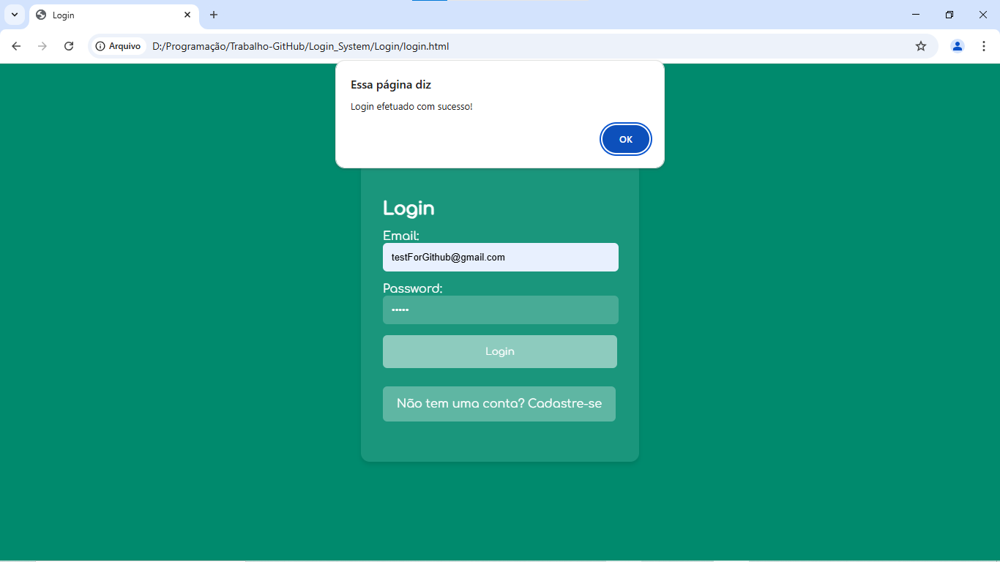
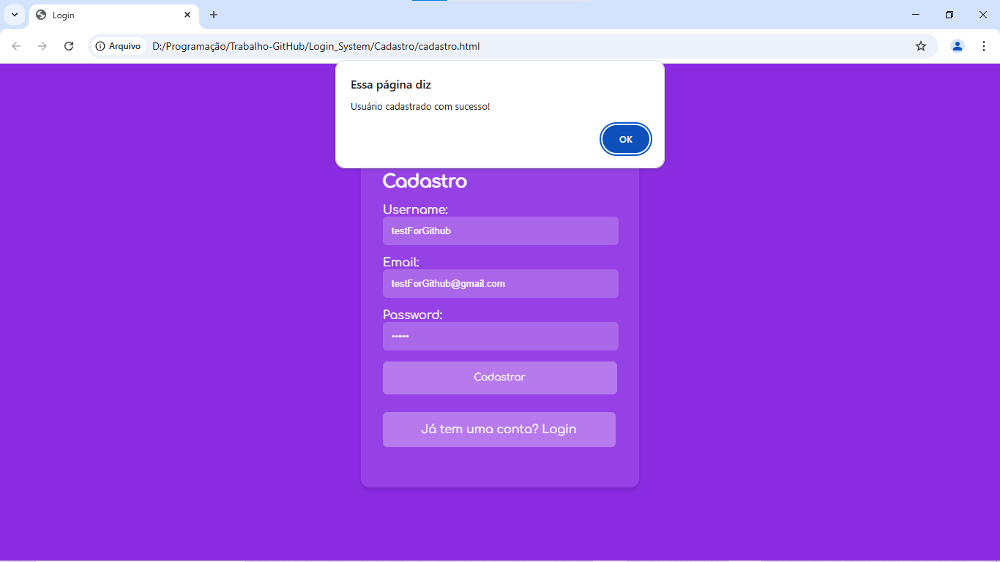
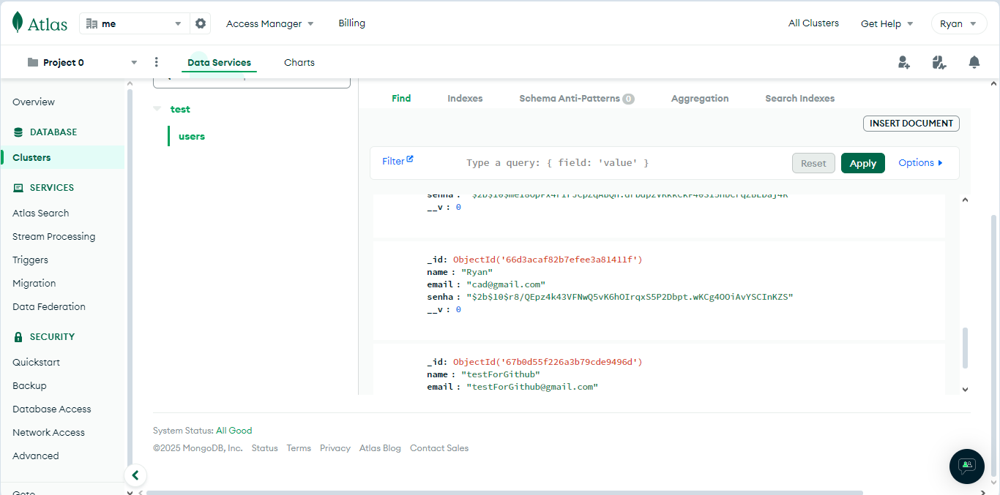
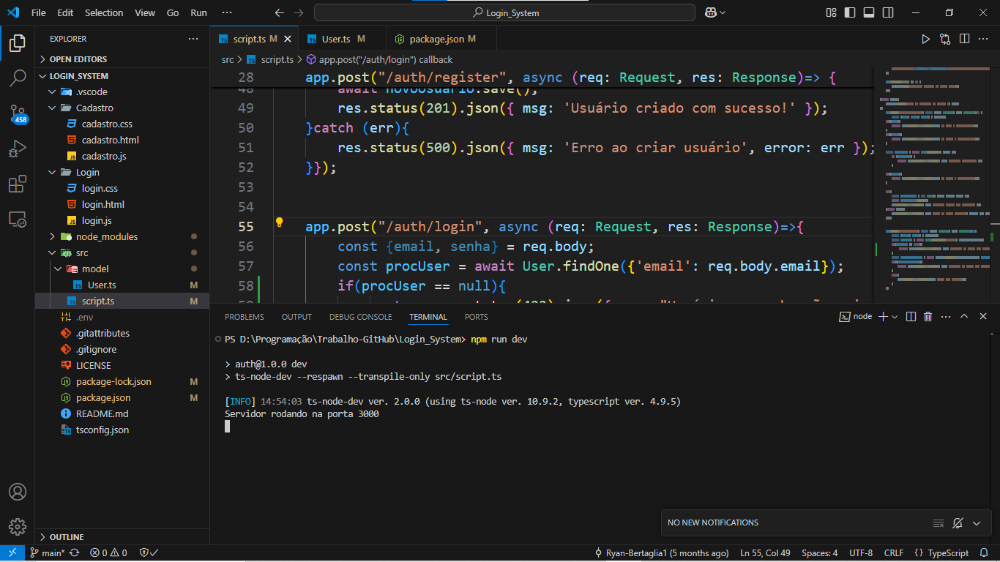

# Login Systems Project
## This project is a system of Login and Sign up, to make this run I have used some tools as:
```
TypeScript as the main language  
Express for readable code  
MongoDB Atlas as the database  
bcrypt to securely encrypt the data
```
## Through this project, I have learned a lot about NoSQL, encryption, and structured languages.


### Login Page


## Register Page


## DataBase Page


## Start Server
